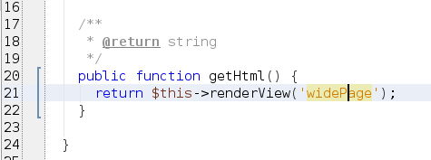
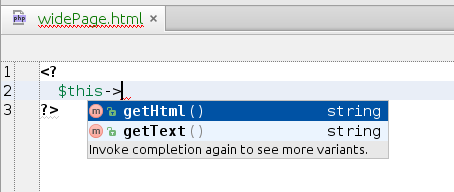

# Viewable PhpStorm plugin

# How to use
1. Install  trait `composer require funivan/viewable` and creat demo view file. See [Viewable package](https://github.com/funivan/Viewable#usage)
2. Install plugin from [releases page](https://github.com/funivan/ViewablePhpStorm/releases) 

# How it works

You can easy navigate to view file by `ctrl+b` or `ctrl+click`

Complection in view

## Todo
- [x] goto: navigate to view
- [x] goto: navigate from view to class
- [ ] inspection: more than one class use same view file
- [ ] completion: complete extracted variables in view files
- [ ] completion: complete view ids in `renderView`
- [ ] refactor: on move class - change view file location
